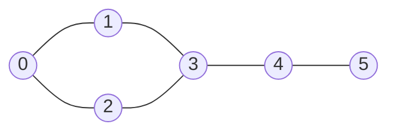

# Homework Assignment 1 (due Oct 2nd 11:59pm)

In this assignment, we will explore dynamic memory allocation, classes 
and objects, and problem solving in general.  The assignment is worth a total 
of 100 points.  If you have any questions or need assistance, please don't 
hesitate to reach out to us during office hours or post your questions 
on the `Ed` forum.

## Preliminaries

You can choose any operating system and development environment you 
prefer, such as `Linux`, `MacOS`, or `Windows`.  However, it is 
strongly recommended that you have access to a `bash` terminal 
to interact with the compiler and other tools.  If you are 
using `Windows`, you can run `Linux` via `WSL` 
(Windows Subsystem for Linux).
Regardless of your choice, your code must compile and run
correctly using the `g++` compiler from the command line.

> [!TIP]
> The use of an integrated development environment (IDE),
> especially one that offers a good debugger, is highly recommended.

## Context

In this assignment you will develop a small `Social Network` application.
A social network can be defined as a network of individuals or 
organizations connected by various social relationships, such as
friendship, common interests, or professional connections.

The dataset used in this assignment is a small subset of the 
Facebook social network.  
The [dataset](https://snap.stanford.edu/data/egonets-Facebook.html)
was collected from survey participants using a Facebook app.  All data has 
been anonymized to protect user privacy.  There are 4,039 users in
the dataset, and each user is represented by a unique integer ID.
Users are connected by friendship links.  There are a total of 
88,234 friendship links in the dataset.

The file containing the dataset is `facebook-combined.txt`, and uses
the following format:

```text
4039 88234
0 1
0 2
0 3
0 4
...
```

The first line contains two integers separated by a space.  The first
integer represents the number of users in the social network, and the
second integer represents the number of friendship connections in the
social network. Each of the following lines contains two
integers separated by a space, representing a friendship connection
between the two users.

You are also provided with a smaller dataset `facebook-small.txt`. We 
strongly encourage you to use the smaller dataset first, as it is easier 
to work with and debug.  Once your code is working correctly with the 
smaller dataset, you can then test it with the larger dataset.  The smaller 
dataset contains only 10 users.

## Sparse Matrices

The simplest way to represent the friendship connections is to use an
**adjacency matrix**, which is a 2D array where the rows and columns
represent the users, and the entries (0 or 1) in the matrix represent 
whether there is a friendship connection between the two users. 
For example, consider the 5x5 matrix below:

```python
0  1  0  1  1     # 0 connected to 1, 3, 4
1  0  1  1  0     # 1 connected to 0, 2, 3  
0  1  0  0  1     # 2 connected to 1, 4
1  1  0  0  0     # 3 connected to 0, 1
1  0  1  0  0     # 4 connected to 0, 2
```

The problem with using an adjacency matrix is that it can be very
large and sparse, especially for large social networks.  In our case,
the adjacency matrix would be a 4039x4039 matrix, which would
require over 16 million entries.  However, there are only 88,234
friendship connections, meaning that the matrix would be mostly
filled with zeros, leading to a waste of memory.

More efficient representations for sparse matrices exist.  These
representations only store the non-zero entries in the matrix,
along with their row and column indices.  This can lead to significant
savings in memory, especially for large sparse matrices.
Three common representations for sparse matrices are:

- COO (Coordinate format): uses three arrays to store row indices,
  column indices, and values of the non-zero entries in the matrix.

```python
rows = [0, 0, 0, 1, 1, 1, 2, 2, 3, 3, 4, 4] # row indices
cols = [1, 3, 4, 0, 2, 3, 1, 4, 0, 1, 0, 2] # column indices
data = [1, 1, 1, 1, 1, 1, 1, 1, 1, 1, 1, 1] # non-zero values
```

- CSR (Compressed sparse row format): uses three arrays to store
  non-zero values, column indices of the non-zero values, and
  a row pointer array that indicates the start of each row in the
  other two arrays.

```python
data = [1, 1, 1, 1, 1, 1, 1, 1, 1, 1, 1, 1] # non-zero values
col_ind = [1, 3, 4, 0, 2, 3, 1, 4, 0, 1, 0, 2] # column indices
row_ptr = [0, 3, 6, 8, 10, 12] # row pointer
```

- CSC (Compressed sparse column format): uses three arrays to store 
  non-zero values, row indices of the non-zero values, and
  a column pointer array that indicates the start of each column
  in the other two arrays.

```python
data = [1, 1, 1, 1, 1, 1, 1, 1, 1, 1, 1, 1] # non-zero values
row_ind = [1, 3, 4, 0, 2, 3, 1, 4, 0, 1, 0, 2] # row indices
col_ptr = [0, 3, 6, 8, 10, 12] # column pointer
```

> [!TIP]
> Note that the original adjacency matrix is symmetric, meaning that
> if user A is friends with user B, then user B is also friends with 
> user A. The file lists each friendship only once, so you have a choice:
> store it once, or store it twice, once in each direction.
>
> **Store it twice.** It costs a little memory and makes everything after
> Task 1 simpler, because all the friends of user `u` then live in one place.
> `get_num_connections()` must still return 88,234, the number in the file
> header, not the number of entries you ended up storing.

## Task 1 (30 points)

In this task, the goal is to develop a class `Network` that represents
the social network.  The class' **constructor** should be able 
to read the dataset from a text file and store the friendship connections 
in an appropriate data structure.

You are free to pick any of the three sparse matrix representations
mentioned above (COO, CSR, CSC) to store the friendship connections.
In fact, you can also choose to implement more than one representation
and compare their performance.  The choice is yours.

> [!TIP]
> As the `data` array is always filled with 1s (indicating a friendship 
> connection), you can choose to omit it from your implementation.

The class **MUST** declare all data elements as `private` and provide
`public` methods to access and manipulate the data.  

To implement your class, you will need to use dynamic memory allocation
to allocate memory for the arrays that store the friendship connections.
Their lengths will depend on the exact number of users and friendship
connections existing in the dataset, which are only known at *runtime*
when reading the dataset from the file, hence the need for dynamic memory
allocation.

> [!IMPORTANT]
> ### Raw pointers, not `std::vector`.
>
> The arrays holding the friendships must be raw pointers, allocated with
> `new[]` and freed with `delete[]` in your destructor.  **Do not use
> `std::vector`, or any other standard library container, anywhere in
> `network.h` or `network.cpp`.**
>
> This is not a style preference.  `std::vector` frees its own memory and
> copies itself correctly, so it would write your destructor and all of Task 6
> for you, and those are the two things this assignment exists to teach.  You
> will use `std::vector` for the rest of your career.  Write the pointers once,
> by hand, first.
>
> `std::string` and `std::ifstream` are needed and allowed.  So is
> `<algorithm>`, for things like `std::sort` and `std::binary_search`, which
> are algorithms rather than containers and work fine on raw arrays.  If you
> need scratch space inside a method, allocate an array for it and free it
> before you return.
>
> The autograder checks this before it looks at anything else.  A submission
> that uses a container scores zero, however correct it is.

**You design the class. We only set its public interface.**

The autograder compiles its own test program against your `network.h`, so the
public part below has to **match exactly**, down to the `const`.  Everything
private is yours: which arrays you declare, how many, what each one holds, and
any helper methods you want.  Copy the block below into `network.h` and fill in
the private section.  Protect the header against multiple inclusion with
include guards.

```cpp
class Network {
    private:
        // YOUR DESIGN GOES HERE.
        //
        // You will need num_users and num_connections, and pointers to the
        // arrays holding the friendships.  Which arrays, and how many, depends
        // on the representation you picked.  Write a comment at the top of the
        // file naming that representation.
        //
        // Add any private helper methods you want.

    public:
        // Reads the dataset and allocates the arrays.
        // Throws std::runtime_error if the file cannot be opened.
        Network(const std::string &filename);

        // Frees everything the constructor allocated.
        ~Network();

        // The rule of three (Task 6).
        Network(const Network &other);
        Network &operator=(const Network &other);

        int  get_num_users() const;        // 4039 for the full dataset
        int  get_num_connections() const;  // 88234, as in the file header

        // True if the two users are friends.  Throws std::out_of_range if
        // either id is outside 0 .. num_users-1.
        bool is_friend(int user_id1, int user_id2) const;

        // Tasks 2 to 5.
        int num_friends(int user_id) const;
        int num_friends_of_friends(int user_id) const;
        int num_mutual_friends(int user_id1, int user_id2) const;
        int most_popular_user() const;
};
```

Every method above is `const` because none of them changes the network.  If you
leave a `const` off, the autograder will not compile against your header and
you will score zero, so copy the block rather than retyping it.

> [!IMPORTANT]
> The implementation of all class methods should be in a separate file
> named `network.cpp`.  You should not put any implementation in the
> header file `network.h`.

### What Task 1 is graded on

- the constructor (8 points)
- `is_friend` (8 points)
- exceptions (7 points)
- the destructor (7 points)

Each of the four is all or nothing: one wrong answer costs that whole part, and
the other three are unaffected.

### Testing your code

`starter/` contains two files for testing: `checks.h`, the same small harness
you used in Lab 01, and `test_network.cpp`, a set of tests written against
`facebook-small.txt`.  Build and run them from `starter/`:

```bash
$ g++ -std=c++17 -Wall -Wextra -Werror -g network.cpp test_network.cpp -o test_network
$ ./test_network
```

You get one line per failing check, with the expression and its line number,
and a count at the end.  Keep going until you see `ALL TESTS PASSED`.

Work on the small dataset first.  It has 10 users and you can **check every
answer by hand** from the table at the top of `test_network.cpp`.  Only move to
`facebook-combined.txt` once the small one passes.

At the bottom of `test_network.cpp` there is a `test_your_cases` function.
**Add at least two tests of your own there.**  At least one must be a case you
actually got wrong, or expected to get wrong.

The autograder runs the same harness on the full dataset, plus a few cases you
have not seen.  Passing locally is a good sign, not a guarantee.

## Task 2 (10 points)

You will add a public method to the `Network` class that computes the number
of friends of a given user.  The method should have the following
signature:

```cpp
int num_friends(int user_id) const;
```

If the user ID is invalid (i.e., not in the range of 0 to num_users-1),
the method should throw an `std::out_of_range` exception.

## Task 3 (15 points)

You will add another public method to the `Network` class that computes the
number of users that are either friends or friends of friends of a given user.
The method should have the following signature:

```cpp
int num_friends_of_friends(int user_id) const;
```

Count every such user **once**, and **do not count `user_id` itself**.  In
other words: how many users can you reach from `user_id` in one or two steps?



For user `0` above, the friends are `1` and `2`, and through them you also
reach `3`.  User `4` is three steps away and does not count, and user `0` does
not count itself, so the answer is **3**.  For user `5`, the only friend is
`4`, and through `4` you reach `3`, so the answer is **2**.

If the user ID is invalid (i.e., not in the range of 0 to num_users-1),
the method should throw an `std::out_of_range` exception.

> [!TIP]
> ### "Counted already?" without a `std::set`
>
> The obvious way to collect distinct users is a `std::set`, and you are not
> allowed one.  That is deliberate, and it is not just about pointer practice:
> here the set is the **worse** tool.
>
> User ids are not arbitrary keys.  They run from `0` to `num_users - 1` with
> no gaps, so you can keep the answer to *have I counted this user already?* in
> an array indexed by the id itself.  Marking and testing are then a single
> array access each, instead of a search through a tree plus a heap allocation
> per insert.
>
> Both versions, over all 4,039 users, same answers:
>
> | | `-O0` | `-O2` |
> |---|---:|---:|
> | `std::set` | 3.020 s | 0.736 s |
> | array indexed by user id | 0.092 s | 0.016 s |
>
> The array costs about 4 KB.  Allocate it, use it, and **free it before you
> return** on every path out of the method.
>
> You will meet this idea again later in the term, under the name *direct
> addressing*.  It is why hash tables are fast.

## Task 4 (15 points)

Add a public method to the `Network` class that computes how many mutual
friends two users have.  The method should have the following signature:

```cpp
int num_mutual_friends(int user_id1, int user_id2) const;
```

If either user ID is invalid (i.e., not in the range of 0 to num_users-1),
the method should throw an `std::out_of_range` exception. If the two user IDs are the same,
the method should return the number of friends of that user.

## Task 5 (10 points)

Add a public method to the `Network` class that computes the most popular user
in the network.  The most popular user is defined as the user with the
highest number of friends.  The method should have the following signature:

```cpp
int most_popular_user() const;
```

If there are multiple users with the same highest number of friends,
the method should return the user with the smallest user ID.

## Task 6 (20 points)

Your class holds raw pointers.  That means C++ does **not** know how to copy it
correctly, and if you do not tell it, it will guess wrong.  Left alone, the
compiler writes a copy constructor and an assignment operator that copy the
*pointers* rather than what they point at.  Two `Network` objects then share
one array, and the second destructor frees memory that was already freed.

Implement all three:

```cpp
~Network();                                     // you already wrote this
Network(const Network &other);                  // copy constructor
Network &operator=(const Network &other);       // copy assignment
```

This is called the **rule of three**: if your class needs one of them, it needs
all three.  Two things to get right:

- **Copy the arrays, not the pointers.** Allocate new arrays in the copy and
  copy the contents across.
- **Handle `a = a`.** If your assignment operator frees its arrays before
  copying, then assigning an object to itself frees the very data it is about
  to read.  Check for it.

`test_network.cpp` has four cases for this.  Two are worth understanding.

`copy outlives original` destroys the original and then uses the copy.  A copy
that shares its arrays with the original passes every other check in the file
and dies on that one.

`no leaks` counts.  Nothing else in the file notices a missing `delete[]`: a
leaking `Network` gives every right answer until the machine runs out of
memory.  So the harness replaces the global `new[]` and `delete[]` with
versions that move a counter, and `checks::arrays_in_use()` reports it.  Take
the count before, build and destroy some networks, and check it came back:

```cpp
const long long before = checks::arrays_in_use();
{
    Network net("facebook-small.txt");
}
CHECK_ALL_FREED(before);
```

If the counter is higher afterwards, the destructor did not free everything.
`std::vector` and `std::string` do not use the array form, so the counter shows
only the arrays you allocated yourself.

Ten of the points come from the copies being correct, ten from nothing
leaking.

> [!TIP]
> When something crashes for reasons you cannot see, build with the address
> sanitizer.  It is slower, and it names the exact line where a pointer went
> wrong:
>
> ```bash
> $ g++ -std=c++17 -g -fsanitize=address network.cpp test_network.cpp -o test_asan
> $ ./test_asan
> ```
>
> This works on Linux, on WSL, and on macOS.  On macOS it will not report
> leaks, only double frees and reads of freed memory.  That is fine here: the
> `no leaks` case counts allocations itself, so it catches a missing `delete[]`
> on every platform, with or without the sanitizer.

## The leaderboard

Every correct submission scores 100, whichever representation you picked.

But Gradescope also records **how long each of your methods took** and puts it
on a leaderboard.  That number is not part of your grade.  It is there because
COO, CSR and CSC are not equally good at answering these questions, and the
gap is not small.  Here are two correct solutions to this assignment, both
scoring 100, on the same machine:

| method | solution A | solution B |
|---|---:|---:|
| `is_friend` | 0.028 s | 0.039 s |
| `num_friends` | 0.028 s | 0.033 s |
| `num_friends_of_friends` | 0.028 s | 0.219 s |
| `most_popular_user` | 0.028 s | 2.203 s |

That last row is a factor of **74**, from nothing but the choice of which
arrays to declare.  Lab 01 made the same point with two algorithms we handed
you.  Here the decision is yours.

> [!WARNING]
> The autograder gives each method **45 seconds** on the full dataset and stops
> it after that.  Every representation discussed above finishes in well under a
> second, so this only catches a method that is doing far more work than it
> needs to, such as one that answers `most_popular_user` by asking `is_friend`
> about every pair of users.  A method that is stopped loses its own task and
> nothing else.

## Submission and grading

This assignment relies on automated evaluation.
Once you are finished, you **must** submit 
the files listed below via [Gradescope](https://www.gradescope.com/) 
to record your grade.

Use the exact filenames provided here:

- `network.h`
- `network.cpp`
- `test_network.cpp` (with the two test cases you added to `test_your_cases`)
- `answers.md`
- `llm-usage.txt`

Your code must compile clean with:

```bash
$ g++ -std=c++17 -Wall -Wextra -Werror network.cpp test_network.cpp -o test_network
```

`answers.md` is four short questions, in the file in `starter/`.  It is not
autograded, but it is required: a submission without it is incomplete.

The `llm-usage.txt` file should contain: the name of the LLM, 
if you used one, and a copy of the prompts you entered and the 
responses you received.  If you did not use an LLM, 
simply write "No LLM used".

> [!CAUTION]
> Remember, academic integrity is of utmost importance.  Any attempts at
> cheating or plagiarism will result in a forfeiture of credit.  Potential
> further actions include failing the class or referring the case for
> disciplinary measures.
