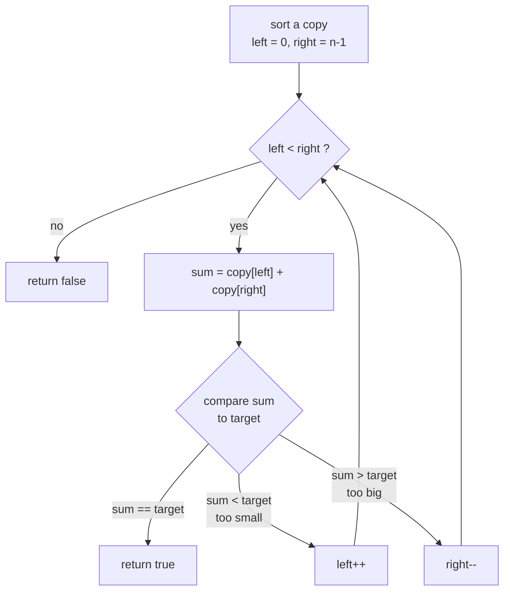
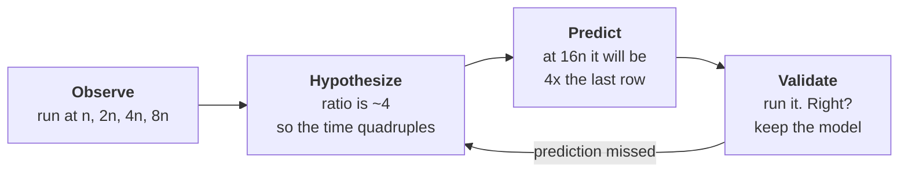

# Lab 01: Empirical analysis

Two algorithms. Same problem. Same answers, every time, on every input. At the
largest input size in this lab one of them is more than **150x slower** than the
other, and that gap keeps growing. 

Today you will compare them *by measurement*, and then you will do something
harder and more useful: you will **predict a number you have not measured yet**,
and check whether you were right.

You need a working `g++` and a terminal -> [`setup.md`](setup.md).
Do this **before** lab; it takes 15 minutes.

> [!CAUTION]
> ### Turn off AI autocomplete for this lab.
>
> How to switch it off, in VS Code and in other editors:
> [`setup.md` -> Turn off AI autocomplete](setup.md#turn-off-ai-autocomplete).

> [!IMPORTANT]
> **Work inside `starter/`.** Everything you write goes there, and every command
> in this handout runs from that one directory. Start by going there and staying
> there:
>
> ```bash
> $ cd starter
> ```

## Task 1: Is your toolchain alive?

Create `hello.cpp` **in `starter/`**. Read an integer $n$ from the user and
print a pyramid of $n$ rows of asterisks. For $n = 5$:

```
    *
   ***
  *****
 *******
*********
```

Compile and run:

```bash
$ g++ -std=c++17 -Wall -Wextra hello.cpp -o hello
$ ./hello
```

Once it works, add `-Werror`, which promotes every warning to an error. Get it
compiling clean:

```bash
$ g++ -std=c++17 -Wall -Wextra -Werror hello.cpp -o hello
```

> **Before you move on, count.** Row 1 prints 1 star, row 2 prints 3, row 3
> prints 5. Row $i$ prints $2i - 1$. So the whole pyramid prints
>
> $$1 + 3 + 5 + \dots + (2n-1) = n^2 \text{ stars.}$$
>
> Double $n$ and you print **four times** as many stars. You just wrote a
> _quadratic program_, and you can see the shape of its cost on the screen, the
> number of stars *represents* the computational cost.

## Task 2: 2-SUM

> **Problem.** Given an array $A$ of $n$ integers and a target $t$, decide
> whether **two elements** of $A$ sum to $t$.

| index | 0 | 1 | 2 | 3 | 4 | 5 | 6 | 7 |
|---|---|---|---|---|---|---|---|---|
| $A$ | 4 | 3 | -5 | 0 | 9 | -2 | 7 | 1 |

$t = 12$ -> **yes** ($9 + 3$).  $t = 20$ -> **no**.

**Read the contract in `starter/two_sum.h` before you write anything.**

> The two elements must sit at **two distinct positions**. You may not
> pair an element with itself.

### brute force

Open `starter/two_sum.cpp` and fill in `two_sum_brute_force`. Check every
unordered pair. **Return early** when you find one.

**Before you type:** how many pairs does an array of $n$ elements have? Write
the formula in `answers.md` now. You will compare it to a measurement later.

### sort, then two pointers

Fill in `two_sum_two_pointer`. The copy and the `std::sort` are already written
for you; you write the scan. Read the steps and the chart below to understand 
the algorithm.

After sorting, the smallest element is at the left end of the array and the
largest is at the right end. Put one index at each end of the **sorted** copy
and follow these steps in a loop:

- compute the sum of the two elements at those indices, `sum = copy[left] + copy[right]`
- if `sum == target` -> found it, return true
- if `sum < target` -> the smallest element left is too small, so `left++`
- if `sum > target` -> the largest element left is too big, so `right--`
- stop when `left >= right`, which means you have scanned the whole array without finding a pair.



**Trace it on paper first** with `copy = {-5, -2, 0, 3, 8}` and `target = 1`.

> **Why is throwing away a whole element safe?** If `copy[left] + copy[right]`
> is *less* than the target, then `copy[left]` paired with **anything still in
> range** is also less than the target, because the array is sorted and
> `copy[right]` is the largest thing left. So `copy[left]` cannot be part of any
> answer, and discarding it loses nothing. Mirror the argument for the other
> side.

### Test it

```bash
$ g++ -std=c++17 -Wall -Wextra -g two_sum.cpp test_two_sum.cpp -o test_two_sum
$ ./test_two_sum
```

> **Why two `.cpp` files on one command line?** `two_sum.cpp` has no `main`, and
> `test_two_sum.cpp` has one. `g++` compiles both and links
> them into a single program. Implementation in one file, the program that uses 
> it in another.

You get one line per failing check, with the expression and its line number, and
a count at the end. Keep going until you see `ALL TESTS PASSED`.

The test file is worth reading. Two of its tests are **techniques**, not busywork. 
They are worth understanding.

- **`test_input_is_not_modified`**: your function promised not to touch the
  caller's array. Sorting `array` instead of `copy` passes every other test in
  the file and fails this one.
- **`test_agreement_on_random_inputs`**: 2,000 random arrays, every target,
  both of your functions checked against an obviously-correct reference. This is
  **differential testing**, and it finds off-by-one bugs that hand-picked cases
  will likely miss. Note the fixed seed: when it fails, it fails the same way
  for your TA.

> **Then add two tests of your own** at the bottom, in `test_your_cases`. At least one
> must be a case you actually got wrong, or expected to.

## Interlude: how to read a column of timings

You are about to produce a column of numbers like `0.18, 0.71, 2.84, 11.33`,
each of them representing the time it took to run an algorithm on a specific input size.
On its own that column is close to worthless: it describes **your laptop, at this
moment, with those browser tabs open**. Run it on a different machine and
every number changes.

So do not read the numbers. **Read the ratios between them.**

> [!IMPORTANT]
> ### The doubling ratio
>
> Run at $n,\ 2n,\ 4n,\ 8n, \dots$. Each input size is **double** the last.
> Then divide each timing by the one above it.
>
> That single number, *what the time multiplies by when the input doubles*,
> names the growth.

| time multiplies by | growth | meaning |
|:---:|---|---|
| $\approx 1$ | constant | the size barely matters |
| $\approx 2$ | linear | twice the input, twice the time |
| $\approx 4$ | **quadratic** | twice the input, **four times** the time |
| $\approx 8$ | cubic | twice the input, eight times the time |

### Why it works, in two lines

Suppose the running time follows a power law, $T(n) \approx c \cdot n^{b}$, for
some constant $c$ you do not know and some exponent $b$ you want. Then

$$\frac{T(2n)}{T(n)} = \frac{c(2n)^{b}}{cn^{b}} = 2^{b}
\qquad\Longrightarrow\qquad b = \log_{2}\left(\frac{T(2n)}{T(n)}\right)$$

**Look at what happened to $c$.** It cancelled. And $c$ is where *everything*
about your machine lives: clock speed, compiler version, `-O2` or not, the
language, how busy the laptop is. None of it survives the division.

> **The seconds measure your hardware. The ratio measures your algorithm.**
> A ratio of 4 on your laptop is a ratio of 4 on a supercomputer. That is why
> this technique is worth more than any single timing you will ever take: it
> works on anything you can time, including systems whose source you cannot read.

### You have already met a 4 today

Task 1's pyramid printed $1 + 3 + \dots + (2n-1) = n^{2}$ stars. Double $n$ and
you print four times as many. Same number, from counting instead of measuring,
and when those two methods agree, you can believe both.

### And it predicts



A model that only explains numbers you already have is a summary. **A model
earns its keep by predicting a measurement you have not taken yet**.

## Task 3: Measure it

```bash
$ g++ -std=c++17 -Wall -Wextra -O2 two_sum.cpp bench.cpp -o bench
$ ./bench 15
```

This runs both algorithms on arrays of $n = 2^{10}=1024, 2^{11}=2048, \dots, 2^{15}=32768$,
**each one double the last**, which is the whole reason the method works, and
prints the ratio of each time to the one above it.

Mine, on a 3.2 GHz Core i7-8700B, compiled with `-O2`:

```
n            brute (ms)    ratio  two-ptr (ms)    ratio
-------------------------------------------------------
1024             0.1806        -        0.0217        -
2048             0.7132     3.95        0.0570     2.62
4096             2.8434     3.99        0.1342     2.36
8192            11.3314     3.99        0.2969     2.21
16384           45.2651     3.99        0.6277     2.11
32768          186.9933     4.13        1.1430     1.82
```

> [!NOTE]
> Your **times** will differ: different CPU, different compiler, different
> background load. Your **ratios** should not. That is the entire point of using
> a ratio: every constant in the system (clock speed, compiler, language, how
> many browser tabs you have open) divides out. *The seconds measure your
> hardware; the ratio measures your algorithm.*

**Now read `bench.cpp`.** It is about 125 lines and four of its decisions are labelled
`DECISION`. Each one is a way this benchmark could have produced confident,
plausible, wrong numbers:

1. a **fixed seed**, so the experiment repeats, for your partner, and for you tomorrow;
2. the **median** of 5 runs after an untimed warm-up, not the mean of 5 cold ones;
3. a **`sink` variable**, because at `-O2` the compiler is entitled to notice
   that nobody uses your return value and delete the call entirely, leaving you
   timing an empty loop;
4. the array is built **outside** the timed region, because we are measuring
   2-SUM, not random number generation.

Answer **Q1-Q3** in `answers.md`.

## Task 4: Predict, then measure

This is the part that separates a benchmark from a model.

**Do not run anything yet.** From your table, write down in `answers.md`:

- your predicted **brute-force** time at $n = 65{,}536$,
- your predicted **two-pointer** time at $n = 65{,}536$,
- and the reasoning, in one line each.

*Then* run it:

```bash
$ ./bench 16
```

Record both predicted and actual. **If you were within about 10%, your model is
doing real work**. You now know something about $n = 65{,}536$ that you learned
without measuring it, which means you know something about $n = 10^9$ too.

Answer **Q4** in `answers.md`.

## Task 5: Can the compiler save you?

`-O0` and `-O2` are **optimization levels**. They change how hard the compiler
works on your behalf, and nothing at all about what your program computes.

- **`-O0` is no optimization.** The compiler translates your code more or less
  literally, statement by statement. It compiles quickly, and it is what you
  want while debugging: every variable really lives where you declared it, and
  the line numbers in the debugger match your source.
- **`-O2` turns the compiler loose.** It may keep values in registers instead
  of memory, inline a function call rather than actually making it, unroll a
  loop, reorder instructions, and **delete any computation whose result nobody
  uses**. The answers must come out identical. Only the work done to reach them
  changes.

> That last one is exactly why `bench.cpp` has a `sink` variable
> (`DECISION 3`). At `-O2`, a call whose return value you throw away is a
> computation nobody uses, and the compiler is entitled to remove it.

Now rebuild the *same source* with optimization off, and re-run:

```bash
$ g++ -std=c++17 -Wall -Wextra -O0 two_sum.cpp bench.cpp -o bench_O0
$ ./bench_O0 15
```

Compare the two brute-force columns. On my machine `-O0` was about **11x
slower** at every size, and the ratio column read `4.06, 4.05, 3.97, 4.21,
3.86`. Unchanged.

> [!NOTE]
> **Why `-O2` and not `-O3`?** Because it makes no difference here, and it is
> worth knowing that. The brute force at $n = 32{,}768$ on my machine:
>
> | flag | time | speedup over `-O0` |
> |---|---:|---:|
> | `-O0` | 2033 ms | 1.0x |
> | `-O1` | 185 ms | **11.0x** |
> | `-O2` | 180 ms | 11.3x |
> | `-O3` | 182 ms | 11.2x |
>
> The entire gain is `-O0` to `-O1`. Everything above that is noise on this
> code, and `-O3` is not reliably faster than `-O2` in general: it trades code
> size for aggressive inlining and vectorization, which sometimes loses. `-O2`
> is the level most projects actually ship.
>
> Try it yourself, it is two more compiles. **And notice that the ratio column
> is 4 in every one of those four builds.**

Answer **Q5** in `answers.md`: what did `-O2` buy, what did it *not* buy, and
why can't a compiler fix this one?

## Submission

Upload the following files to Gradescope:

- `hello.cpp`
- `two_sum.cpp` (your two implementations)
- `test_two_sum.cpp` (with the two test cases you added to `test_your_cases`)
- `answers.md`

> [!WARNING]
> **Upload the four files themselves, and nothing else.** The autograder checks
> this before it looks at your code.

Your code should compile clean under `-Wall -Wextra -Werror` and be readable.

Questions: ask the instructor or a TA **in the room**, or post on Ed.
