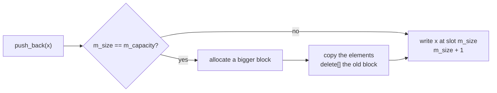
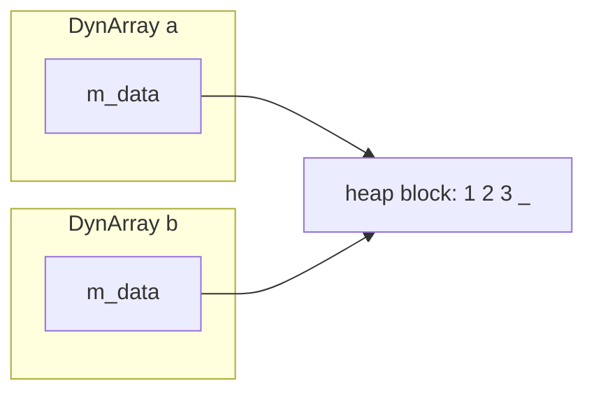
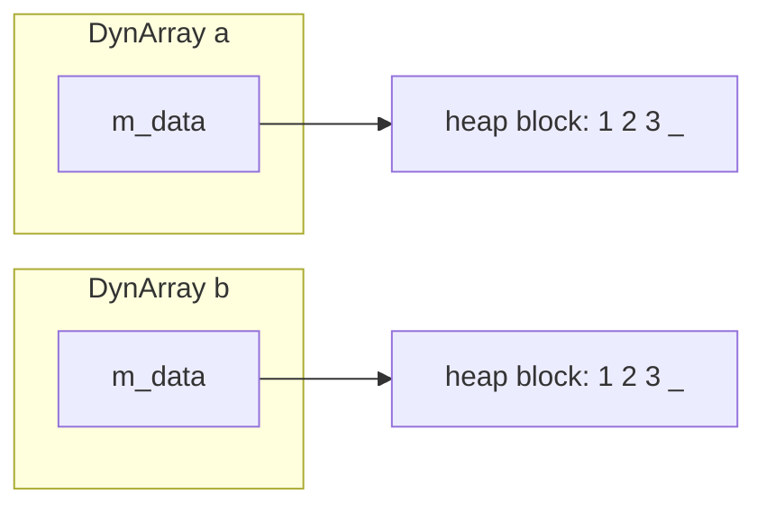

# Lab 03: Dynamic arrays

Today you will build a dynamic array from scratch: a class that allocates its
own memory, **grows** when it runs out of room, gives every block back, and
knows how to **copy** itself. Then you will measure what growing costs.
Appending 131,072 ints while growing by 1 slot at a time costs **8.6 billion**
element copies. Growing by 1,000 slots costs 8.6 million. Same rule, two
constants: the measurement shows you what a constant can buy, and what it
cannot.

You need a working `g++` and a terminal.

> [!CAUTION]
> Turn off AI autocomplete for this lab. How to switch it off,
> in VS Code and in other editors:
> [Turn off AI autocomplete](../lab-01/setup.md#turn-off-ai-autocomplete).

Work in `starter/`. It holds three files you do not change: `check.h` (a small
test harness), `bench.cpp` (for Task 5), and `answers.md`. You create three
files there: `dynarray.h`, `dynarray.cpp`, and `test_dynarray.cpp`.

Every task ends the same way. Compile and run:

```bash
$ cd starter
$ g++ -std=c++17 -Wall -Wextra -g dynarray.cpp test_dynarray.cpp -o test_dynarray
$ ./test_dynarray
```

A failing check prints its line number. Do not start the next task until you
see `ALL TESTS PASSED`.

## Task 1: A minimal class

A dynamic array keeps its elements in a block of memory on the heap. Its
internal state is four data members:

```
index:     0   1   2   3   4   5   6   7
         +---+---+---+---+---+---+---+---+
m_data:  | 4 | 3 | 9 | 1 | ? | ? | ? | ? |
         +---+---+---+---+---+---+---+---+
                           ^ m_size = 4     ^ m_capacity = 8
```

- `m_data`: the memory address of the block
- `m_size`: how many elements are stored (4 above)
- `m_capacity`: how many slots the block has (8 above)
- `m_increment`: how many slots to add when the block is full (Task 3)

Note that slots 4 to 7 exist, but they hold garbage. They are not elements of the array.

The constructor takes the increment, a constant value that determines how many slots to add when the array needs to grow. A new array starts **empty**, with one block of `increment` slots. The destructor frees that block.

### Declare

Create `dynarray.h`:

```cpp
#ifndef DYNARRAY_H
#define DYNARRAY_H

#include <cstddef>

class DynArray {
    private:
        int*   m_data;       // the block: m_capacity ints on the heap
        size_t m_size;       // elements stored
        size_t m_capacity;   // slots allocated
        size_t m_increment;  // slots added by each grow (Task 3)

    public:
        explicit DynArray(size_t increment);
        ~DynArray();

        size_t size() const;
        size_t capacity() const;
        bool   empty() const;
};

#endif
```

> [!NOTE]
> `size_t` is an unsigned integer type for sizes and indices. It is never
> negative. `explicit` stops C++ from turning a number into a `DynArray` on
> its own: `DynArray a = 4;` does not compile, `DynArray a(4);` does.

### Implement

Create `dynarray.cpp`:

```cpp
#include "dynarray.h"

#include <stdexcept>

DynArray::DynArray(size_t increment) {
    // TODO: if increment is 0, throw std::invalid_argument("increment must be positive")
    // TODO: set m_increment and m_capacity to increment, and m_size to 0
    // TODO: allocate the block: m_data = new int[m_capacity];
}

DynArray::~DynArray() {
    // TODO: free the block with delete[]
}

size_t DynArray::size() const {
    // TODO: return the number of elements in the array
}

size_t DynArray::capacity() const {
    // TODO: return the number of slots in the array
}

bool DynArray::empty() const {
    // TODO: true when there are no elements
}
```

### Test

Create `test_dynarray.cpp`:

```cpp
#include <stdexcept>

#include "check.h"
#include "dynarray.h"

static void test_minimal() {
    section("task 1: a minimal class");
    const long long before = arrays_in_use();
    {
        DynArray a(4);
        CHECK(a.size() == 0);
        CHECK(a.capacity() == 4);
        CHECK(a.empty());
        CHECK(arrays_in_use() == before + 1);  // the constructor allocated
    }
    CHECK(arrays_in_use() == before);          // the destructor freed
    CHECK_THROWS(DynArray bad(0), std::invalid_argument);
}

int main() {
    std::cout << "running tests\n";
    test_minimal();
    return summary();
}
```

`arrays_in_use()` comes from `check.h`. It counts the blocks allocated with
`new []` and not freed yet. The `{ }` braces end the life of `a`, so its
destructor runs before the last two checks.

Compile, run, and answer **Q1** in `answers.md`.

## Task 2: Storing elements

Now the array holds elements. Three new methods:

- `push_back(value)` writes `value` into the first free slot, slot `m_size`,
  and adds 1 to `m_size`
- `at(i)` returns element `i`
- `set(i, value)` overwrites element `i`

`at` and `set` throw `std::out_of_range` when `i >= m_size`. Compare with
**size**, not capacity: a slot past the end is not an element.

For now, a full array cannot take more: `push_back` on a full array throws
`std::length_error`. Task 3 fixes that.

### Declare

Add to the `public:` section of `dynarray.h`:

```cpp
        int  at(size_t i) const;
        void set(size_t i, int value);
        void push_back(int value);
```

### Implement

Add to `dynarray.cpp`:

```cpp
int DynArray::at(size_t i) const {
    // TODO: if i >= m_size, throw std::out_of_range("index past the end")
    // TODO: return element i
}

void DynArray::set(size_t i, int value) {
    // TODO: same check as at()
    // TODO: overwrite element i
}

void DynArray::push_back(int value) {
    // TODO: if m_size == m_capacity, throw std::length_error("array is full")
    // TODO: write value into slot m_size
    // TODO: add 1 to m_size
}
```

### Test

Add this function to `test_dynarray.cpp`, above `main`. Call it from `main`,
after `test_minimal();`:

```cpp
static void test_storing() {
    section("task 2: storing elements");
    DynArray a(4);
    a.push_back(10);
    a.push_back(20);
    a.push_back(30);
    CHECK(a.size() == 3);
    CHECK(a.capacity() == 4);
    CHECK(!a.empty());
    CHECK(a.at(0) == 10);
    CHECK(a.at(2) == 30);

    a.set(1, 99);
    CHECK(a.at(1) == 99);
    CHECK(a.at(0) == 10);  // set changes one element

    CHECK_THROWS(a.at(3), std::out_of_range);  // slot 3 exists, not an element
    CHECK_THROWS(a.set(3, 0), std::out_of_range);

    a.push_back(40);
    CHECK(a.size() == 4);  // full
    CHECK_THROWS(a.push_back(50), std::length_error);
}
```

Compile, run, and answer **Q2**.

## Task 3: Growing

A full array must grow. The memory right after the block may belong to
someone else, so the block cannot get longer where it is. Growing means
**moving**:



The rule is **grow by a constant**: the new capacity is
`m_capacity + m_increment`. Here is `DynArray a(3)` taking five pushes:

```
push 1, 2, 3:   | 1 | 2 | 3 |                    size 3, capacity 3

push 4, full:   | 1 | 2 | 3 |   |   |   |        new block of 6, copy 3 elements
                | 1 | 2 | 3 | 4 |   |   |        size 4, capacity 6

push 5, room:   | 1 | 2 | 3 | 4 | 5 |   |        size 5, capacity 6, no copy
```

Every grow copies every element. To see what that costs, the class counts:

- `m_copies`: elements copied by all grows so far
- `m_grows`: how many grows so far

### Declare

Add to the `private:` section of `dynarray.h`:

```cpp
        size_t m_copies;     // elements copied by grow(), in total
        size_t m_grows;      // times grow() ran

        void grow();
```

Add to the `public:` section:

```cpp
        size_t copies() const;
        size_t grows() const;
```

`grow` is private: only the class decides when to grow.

### Implement

In the constructor, set `m_copies` and `m_grows` to 0. Then add:

```cpp
void DynArray::grow() {
    // TODO: allocate a new block of m_capacity + m_increment ints
    // TODO: copy the m_size elements into it
    // TODO: delete[] the old block
    // TODO: point m_data at the new block, update m_capacity
    // TODO: add m_size to m_copies, add 1 to m_grows
}

size_t DynArray::copies() const {
    // TODO: return the number of elements copied by all grows so far
}

size_t DynArray::grows() const {
    // TODO: return the number of times the array has grown so far
}
```

In `push_back`, replace the `throw std::length_error` line with a call to
`grow()`.

> [!WARNING]
> Forget the `delete[]` on the old block and every grow leaks it. The program
> still gives the right answers, so only the leak check tells you.

### Test

The rule changed, so one old check is now wrong. **Delete** this line from
`test_storing`:

```cpp
    CHECK_THROWS(a.push_back(50), std::length_error);
```

Then add this function, and call it from `main`:

```cpp
static void test_growing() {
    section("task 3: growing");
    DynArray a(3);
    const size_t expected[10] = {3, 3, 3, 6, 6, 6, 9, 9, 9, 12};
    bool capacity_ok = true;
    for (int i = 0; i < 10; i++) {
        a.push_back(i * i);
        if (a.capacity() != expected[i]) {
            capacity_ok = false;
        }
    }
    CHECK(capacity_ok);
    CHECK(a.size() == 10);

    bool values_ok = true;
    for (int i = 0; i < 10; i++) {
        if (a.at(i) != i * i) {
            values_ok = false;
        }
    }
    CHECK(values_ok);        // growing kept every element, in order

    CHECK(a.grows() == 3);   // at sizes 3, 6, 9
    CHECK(a.copies() == 18); // 3 + 6 + 9

    const long long before = arrays_in_use();
    {
        DynArray b(1);
        for (int i = 0; i < 100; i++) {
            b.push_back(i);  // 99 grows
        }
    }
    CHECK(arrays_in_use() == before);  // every old block was freed
}
```

Answer **Q3** first, on paper. Then compile and run.

## Task 4: pop_back, insert, erase

Three more operations. Each one costs as much as the data it moves.

**`pop_back()`** removes the last element. Nothing moves and nothing is freed:
subtract 1 from `m_size`. The old value stays in memory as garbage.

```
before:   | 10 | 20 | 30 |    |       size 3, capacity 4
after:    | 10 | 20 | 30 |    |       size 2, capacity 4
```

**`insert(idx, value)`** opens a gap at `idx`. Grow first if the array is
full. Move every element from `idx` to the end one slot **right**, starting
from the **back**. Then write the value:

```
insert(1, 15) on [10, 20, 30, 40]

before:   | 10 | 20 | 30 | 40 |    |
shift:    | 10 |    | 20 | 30 | 40 |      moved 40, then 30, then 20
write:    | 10 | 15 | 20 | 30 | 40 |
```

Start from the back, so each element moves into a free slot. `idx == m_size`
is allowed: it inserts at the end.

**`erase(idx)`** closes the gap. Move every element after `idx` one slot
**left**, starting from the **front**. Then subtract 1 from `m_size`:

```
erase(1) on [10, 20, 30, 40]

before:   | 10 | 20 | 30 | 40 |
shift:    | 10 | 30 | 40 | 40 |      moved 30, then 40
after:    | 10 | 30 | 40 |           size 3
```

| operation | elements moved, size $n$ | cost |
|---|---|---|
| `pop_back()` | 0 | $\Theta(1)$ |
| `insert(idx, v)` | $n - idx$ | $\Theta(n)$ at the front |
| `erase(idx)` | $n - idx - 1$ | $\Theta(n)$ at the front |

### Declare

Add to the `public:` section:

```cpp
        void pop_back();
        void insert(size_t idx, int value);
        void erase(size_t idx);
```

### Implement

```cpp
void DynArray::pop_back() {
    // TODO: if the array is empty, throw std::out_of_range("array is empty")
    // TODO: subtract 1 from m_size
}

void DynArray::insert(size_t idx, int value) {
    // TODO: if idx > m_size, throw std::out_of_range("index past the end")
    // TODO: if the array is full, grow()
    // TODO: for (size_t j = m_size; j > idx; j--), move m_data[j - 1] to m_data[j]
    // TODO: write value at idx, add 1 to m_size
}

void DynArray::erase(size_t idx) {
    // TODO: if idx >= m_size, throw std::out_of_range("index past the end")
    // TODO: for (size_t j = idx; j + 1 < m_size; j++), move m_data[j + 1] to m_data[j]
    // TODO: subtract 1 from m_size
}
```

> [!WARNING]
> `size_t` cannot go below 0: `0 - 1` wraps around to a huge number. A loop
> like `for (size_t j = m_size - 1; j >= idx; j--)` never ends when `idx` is
> 0. Use the loops in the TODO comments.

### Test

Add this function, and call it from `main`:

```cpp
static void test_moving() {
    section("task 4: pop_back, insert, erase");
    DynArray a(2);
    a.push_back(1);
    a.push_back(2);
    a.push_back(3);  // capacity 4
    a.pop_back();
    CHECK(a.size() == 2);
    CHECK(a.capacity() == 4);  // nothing is freed
    CHECK_THROWS(a.at(2), std::out_of_range);

    DynArray b(10);
    b.push_back(20);
    b.push_back(40);
    b.insert(1, 30);  // middle: 20 30 40
    b.insert(0, 10);  // front:  10 20 30 40
    b.insert(4, 50);  // end:    10 20 30 40 50
    CHECK(b.size() == 5);
    CHECK(b.at(0) == 10);
    CHECK(b.at(2) == 30);
    CHECK(b.at(4) == 50);
    CHECK_THROWS(b.insert(6, 0), std::out_of_range);

    DynArray full(2);
    full.push_back(1);
    full.push_back(3);
    full.insert(1, 2);  // full: grows first
    CHECK(full.capacity() == 4);
    CHECK(full.at(1) == 2);
    CHECK(full.at(2) == 3);

    b.erase(1);  // 10 30 40 50
    CHECK(b.size() == 4);
    CHECK(b.at(1) == 30);
    b.erase(0);  // 30 40 50
    CHECK(b.at(0) == 30);
    b.erase(2);  // 30 40
    CHECK(b.size() == 2);
    CHECK(b.at(1) == 40);
    CHECK_THROWS(b.erase(2), std::out_of_range);

    DynArray c(1);
    CHECK_THROWS(c.pop_back(), std::out_of_range);

    // Remove every 7.  Only move on when nothing was erased.
    DynArray r(8);
    const int values[] = {7, 7, 1, 7, 7, 2, 7};
    for (int v : values) {
        r.push_back(v);
    }
    size_t i = 0;
    while (i < r.size()) {
        if (r.at(i) == 7) {
            r.erase(i);
        } else {
            i++;
        }
    }
    CHECK(r.size() == 2);
    CHECK(r.at(0) == 1);
    CHECK(r.at(1) == 2);
}
```

Compile, run, and answer **Q4**.

## Task 5: Measure the cost of growing

How many copies do $n$ calls to `push_back` cost with increment $c$? The grows
happen at sizes $c, 2c, 3c, \dots$, and the grow at size $kc$ copies $kc$
elements. For $n = mc$ pushes:

$$\text{copies} = c\,(1 + 2 + \cdots + (m-1)) = \frac{n^2}{2c} - \frac{n}{2}$$

A bigger $c$ divides the copies by $c$. Does it change the growth?

**Predict first.** Use the formula to fill in the **predicted** column of the
Q5 table in `answers.md`, for $n = 131{,}072$.

Then build and run the benchmark. It uses your class:

```bash
$ g++ -std=c++17 -Wall -Wextra -O2 dynarray.cpp bench.cpp -o bench
$ ./bench 17
```

For $c = 1, 10, 100, 1000$ it pushes $n = 1024, 2048, \dots, 131072$ ints,
each $n$ double the last. It prints your `copies()` and `grows()`, the time,
and the **ratio** to the row above, as in Lab 01. The first rows on my
machine:

```
grow by c = 1
n                copies   ratio    grows          ms   ratio
------------------------------------------------------------
1024             523776       -     1023       0.137       -
2048            2096128    4.00     2047       0.281    2.06
4096            8386560    4.00     4095       0.864    3.07
```

The copies are exact: the same on every machine. The time is one noisy run.

Now plot it. `bench` also wrote `growth.csv`. Open `../viewer/index.html` in
your browser and drop `growth.csv` on it.

- On **log-log** axes, the slope of a line is the exponent: slope 1 is
  linear, slope 2 is quadratic.
- The dashed lines are the formula.
- Try **linear** axes, and try plotting **time**.

Answer **Q5** and **Q6**.

> [!IMPORTANT]
> **Grow by a constant is $\Theta(n^2)$, for every constant.** A bigger $c$
> moves the line down. It does not change the slope.

## Task 6: Copying

Your class owns a block of memory. What happens when you copy it?

### Watch it break

Add this test, and call it from `main`. Do **not** add anything to the class
yet:

```cpp
static void test_copying() {
    section("task 6: copying");
    DynArray a(4);
    a.push_back(1);
    a.push_back(2);
    a.push_back(3);

    DynArray b = a;  // copy constructor
    CHECK(b.size() == 3);
    CHECK(b.capacity() == 4);
    CHECK(b.at(2) == 3);

    b.set(0, 100);
    CHECK(a.at(0) == 1);  // a is not changed

    b.push_back(4);
    b.push_back(5);  // b grows
    CHECK(a.size() == 3);
    CHECK(a.at(2) == 3);  // a is still fine

    DynArray c(8);
    c.push_back(-1);
    c = a;  // copy assignment
    CHECK(c.size() == 3);
    CHECK(c.at(1) == 2);
    c.set(1, 99);
    CHECK(a.at(1) == 2);  // a is not changed

    DynArray& same = a;
    a = same;  // self-assignment
    CHECK(a.size() == 3);
    CHECK(a.at(0) == 1);

    DynArray d(1);
    d = c = a;  // chained
    CHECK(d.at(1) == 2);

    const long long before = arrays_in_use();
    {
        DynArray e = a;
        DynArray f(5);
        f = a;
    }
    CHECK(arrays_in_use() == before);
}
```

Compile and run. It compiles, checks fail, and the program probably crashes
before the summary. Run it with the address sanitizer to see why:

```bash
$ g++ -std=c++17 -g -fsanitize=address dynarray.cpp test_dynarray.cpp -o test_asan
$ ./test_asan
```

### What went wrong

You did not say how to copy a `DynArray`, so C++ wrote a copy for you. It
copies each member. For `m_size` and `m_capacity` that is fine. For `m_data`
it copies the **address**, not the block:



This is a **shallow copy**. Two objects share one block:

| what the test does | what happens |
|---|---|
| `b.set(0, 100)` | `a` changes too |
| `b` grows | `b.grow()` frees the shared block. `a.m_data` now points at freed memory |
| end of the function | both destructors free the same block: a **double free** |

You need a **deep copy**: the copy gets its own block, with the same contents.



C++ uses two different functions to copy:

| code | function that runs |
|---|---|
| `DynArray b = a;` or `DynArray b(a);` | copy constructor: `b` is new and owns nothing |
| `b = a;` when `b` already exists | copy assignment, `operator=`: `b` already owns a block |

> [!IMPORTANT]
> **Rule of three:** a class that owns memory needs a destructor, a copy
> constructor, and a copy assignment operator. If it needs one, it needs all
> three.

### Declare

Add to the `private:` section:

```cpp
        void copy_from(const DynArray& other);
```

Add to the `public:` section:

```cpp
        DynArray(const DynArray& other);
        DynArray& operator=(const DynArray& other);
```

### Implement

```cpp
void DynArray::copy_from(const DynArray& other) {
    // TODO: copy m_size, m_capacity, m_increment, m_copies, m_grows from other
    // TODO: allocate a NEW block of m_capacity ints
    // TODO: copy the m_size elements from other.m_data into it
}

DynArray::DynArray(const DynArray& other) {
    // TODO: copy_from(other).  This object is new: nothing to free.
}

DynArray& DynArray::operator=(const DynArray& other) {
    // TODO: if this == &other, skip to the return: a = a must change nothing
    // TODO: delete[] the block this object owns now, or it leaks
    // TODO: copy_from(other)
    // TODO: return *this, so that d = c = a works
}
```

Why each step of `operator=` is there:

- **the `this == &other` check**: without it, `a = a` frees `a`'s block, then
  copies from it
- **`delete[]` first**: `c` owned a block before `c = a`. Nobody else will
  free it
- **`return *this`**: `d = c = a` runs `c = a` first, then assigns the result
  to `d`

Compile and run until you see `ALL TESTS PASSED`.

### Your tests

Add a function `test_your_cases` with **at least two** checks of your own, and
call it from `main`. At least one must be a case you got wrong, or expected to.

Answer **Q7** and **Q8**.

## Submission

Upload these files to Gradescope:

- `dynarray.h`
- `dynarray.cpp`
- `test_dynarray.cpp`
- `answers.md`

> [!WARNING]
> **Upload those four files and nothing else.** The autograder checks this
> before it looks at your code.

Your code should compile clean under `-Wall -Wextra -Werror`.

Questions: ask the instructor or a TA **in the room**, or post on Ed.
